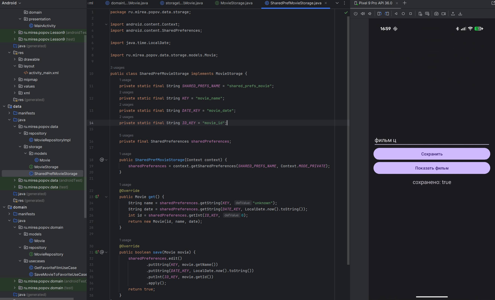

# практика 10 (2)
(т.к. эта практика являлась продолжением предыдущей, то все файлы проекта находятся в папке pr9, а не тут)

## Доработка про фильмы
В этой практике проект из предыдущего задания был переработан под модульную структуру. 

Созданы три отдельных модуля: `app`, `data` и `domain`.
В `domain` вынесена бизнес-логика и интерфейсы, в `data` — реализация репозитория и хранилища `SharedPreferences`, в `app`— слой представления.
Для слоя хранения созданы отдельные модели, что устранило зависимость от `domain`.

В gradle были добавлены зависимости domain и data.




Реализованы мапперы для конвертации между слоями.

Таким образом, приложение стало соответствовать принципам чистой архитектуры, где каждый модуль изолирован и отвечает за свою зону ответственности.

Ниже приведен листинг остального кода:

```java
package ru.mirea.popov.data.storage;

import ru.mirea.popov.data.storage.models.Movie;

public interface MovieStorage {
    Movie get();
    boolean save(Movie movie);
}

```

```java
package ru.mirea.popov.domain.models;

public class Movie {
    private int id;
    private String name;

    public Movie(int id, String name) {
        this.id = id;
        this.name = name;
    }

    public String getName() {
        return name;
    }

    public int getId() {
        return id;
    }
}

```

```java
package ru.mirea.popov.Lesson9.presentation;

import android.os.Bundle;
import android.widget.Button;
import android.widget.EditText;
import android.widget.TextView;
import androidx.appcompat.app.AppCompatActivity;

import ru.mirea.popov.Lesson9.R;
import ru.mirea.popov.data.repository.MovieRepositoryImpl;
import ru.mirea.popov.data.storage.SharedPrefMovieStorage;
import ru.mirea.popov.domain.models.Movie;
import ru.mirea.popov.domain.usecases.GetFavoriteFilmUseCase;
import ru.mirea.popov.domain.usecases.SaveMovieToFavoriteUseCase;

public class MainActivity extends AppCompatActivity {
    @Override
    protected void onCreate(Bundle savedInstanceState) {
        super.onCreate(savedInstanceState);
        setContentView(R.layout.activity_main);

        EditText editTextMovie = findViewById(R.id.editTextMovie);
        TextView textViewMovie = findViewById(R.id.textViewMovie);
        Button buttonSave = findViewById(R.id.buttonSaveMovie);
        Button buttonGet = findViewById(R.id.buttonGetMovie);

        SharedPrefMovieStorage storage = new SharedPrefMovieStorage(this);
        MovieRepositoryImpl repository = new MovieRepositoryImpl(storage);

        SaveMovieToFavoriteUseCase saveUseCase = new SaveMovieToFavoriteUseCase(repository);
        GetFavoriteFilmUseCase getUseCase = new GetFavoriteFilmUseCase(repository);

        buttonSave.setOnClickListener(v -> {
            boolean result = saveUseCase.execute(new Movie(1, editTextMovie.getText().toString()));
            textViewMovie.setText("сохранено: " + result);
        });

        buttonGet.setOnClickListener(v -> {
            Movie movie = getUseCase.execute();
            textViewMovie.setText("ииииз памяти: " + movie.getName());
        });
    }
}

```

## Контрольное задание

Первым делом нарисовал в фигме прототип будущего приложения. Конечно, именно так хорошо оно выглядеть никогда не будет(


Приложение работает. При первом запуске нас встречает экран с авторизацией, которая работает через Firebase. Здесь же можно зарегистрироваться или войти как гость


После авторизации уже можно узнать погоду в Москве. Она отобразится после нажатия на кнопку “Обновить”. Каждое нажатие этой кнопки добавляет в историю новый замер погоды с указанием результата и даты.


**`WeatherFragment.java`** — главный экран приложения. Отображает текущую погоду, выполняет запрос в фоне через `ExecutorService`, а результат возвращает в UI-поток через `Handler`. Кнопка “Обновить” получает свежие данные из API, кнопка “История” — отображает последние запросы из базы Room.


### data

Модуль отвечает за работу с внешними источниками данных (API, база, SharedPreferences).

AppDatabase.java:

Класс базы данных Room.

```java
package ru.mirea.popov.data.db;

import androidx.room.Database;
import androidx.room.RoomDatabase;
import ru.mirea.popov.data.storage.RoomWeatherDao;

@Database(entities = {WeatherEntity.class}, version = 1)
public abstract class AppDatabase extends RoomDatabase {
    public abstract RoomWeatherDao weatherDao();
}

```

WeatherEntity.java:

Это сущность Room, представляющая запись в таблице `weather_history`

```java
package ru.mirea.popov.data.db;

import androidx.room.Entity;
import androidx.room.PrimaryKey;

@Entity(tableName = "weather_history")
public class WeatherEntity {
    @PrimaryKey(autoGenerate = true)
    public int id;
    public String city;
    public double temperature;
    public String description;
    public String date;

    public WeatherEntity(String city, double temperature, String description, String date) {
        this.city = city;
        this.temperature = temperature;
        this.description = description;
        this.date = date;
    }
}

```

WeatherApi.java:

Файл реализует сетевое подключение к открытому API погоды Open-Meteo.

В случае успешного соединения возвращается JSON-объект с текущей температурой.

```java
package ru.mirea.popov.data.network;

import android.util.Log;

import org.json.JSONObject;
import java.io.InputStream;
import java.io.ByteArrayOutputStream;
import java.net.HttpURLConnection;
import java.net.URL;

public class WeatherApi {
    public JSONObject getWeatherData(String city) {
        try {
            String urlStr = "https://api.open-meteo.com/v1/forecast?latitude=55.75&longitude=37.61&current_weather=true";
            URL url = new URL(urlStr);
            HttpURLConnection connection = (HttpURLConnection) url.openConnection();
            connection.connect();

            InputStream input = connection.getInputStream();
            ByteArrayOutputStream output = new ByteArrayOutputStream();

            int b;
            while ((b = input.read()) != -1) {
                output.write(b);
            }

            String jsonString = output.toString();
            connection.disconnect();
            return new JSONObject(jsonString);

        } catch (Exception e) {
            e.printStackTrace();
            Log.e("WeatherApi", "Ошибка получения погоды", e);

            return null;
        }
    }
}

```

WeatherRepositoryImpl.java:

Основная реализация репозитория.
Соединяет `WeatherApi`, `Room` и `PreferencesStorage`, сохраняет историю запросов и преобразует модели между слоями.
При каждом обновлении погоды результат записывается в базу и возвращается в виде объекта `WeatherInfo`.

```java
package ru.mirea.popov.data.repository;

import android.content.Context;
import androidx.room.Room;

import org.json.JSONObject;
import java.time.LocalDate;
import java.util.List;

import ru.mirea.popov.data.db.AppDatabase;
import ru.mirea.popov.data.db.WeatherEntity;
import ru.mirea.popov.data.network.WeatherApi;
import ru.mirea.popov.data.storage.PreferencesStorage;
import ru.mirea.popov.domain.models.WeatherInfo;
import ru.mirea.popov.domain.repository.WeatherRepository;

public class WeatherRepositoryImpl implements WeatherRepository {
    private final WeatherApi api;
    private final PreferencesStorage prefs;
    private final AppDatabase db;

    public WeatherRepositoryImpl(Context context, WeatherApi api, PreferencesStorage prefs) {
        this.api = api;
        this.prefs = prefs;
        this.db = Room.databaseBuilder(context, AppDatabase.class, "weather_db").build();
    }

    @Override
    public WeatherInfo getWeather(String city) {
        JSONObject json = api.getWeatherData(city);
        if (json == null) return new WeatherInfo(city, 0, "Ошибка сети");
        try {
            JSONObject current = json.getJSONObject("current_weather");
            double temp = current.getDouble("temperature");
            WeatherInfo info = new WeatherInfo(city, temp, "Погода получена");
            db.weatherDao().insert(new WeatherEntity(city, temp, info.getDescription(), LocalDate.now().toString()));
            return info;
        } catch (Exception e) {
            return new WeatherInfo(city, 0, "Ошибка парсинга");
        }
    }

    @Override
    public void saveFavoriteCity(String city) {
        prefs.saveCity(city);
    }

    public List<WeatherEntity> getLastWeather() {
        return db.weatherDao().getLastWeather();
    }
}

```

PreferencesStorage.java:

Сохраняет настройки пользователя (последний выбранный город).

```java
package ru.mirea.popov.data.storage;

import android.content.Context;
import android.content.SharedPreferences;

public class PreferencesStorage {
    private static final String PREFS = "weather_prefs";
    private static final String KEY_CITY = "last_city";
    private final SharedPreferences sharedPreferences;

    public PreferencesStorage(Context context) {
        sharedPreferences = context.getSharedPreferences(PREFS, Context.MODE_PRIVATE);
    }

    public void saveCity(String city) {
        sharedPreferences.edit().putString(KEY_CITY, city).apply();
    }

    public String getCity() {
        return sharedPreferences.getString(KEY_CITY, "Москва");
    }
}

```

RoomWeatherDao.java:

Интерфейс DAO с методами `insert()` и `getLastWeather()`.

```java
package ru.mirea.popov.data.storage;

import androidx.room.Dao;
import androidx.room.Insert;
import androidx.room.Query;
import java.util.List;
import ru.mirea.popov.data.db.WeatherEntity;

@Dao
public interface RoomWeatherDao {
    @Insert
    void insert(WeatherEntity weather);

    @Query("SELECT * FROM weather_history ORDER BY id DESC LIMIT 5")
    List<WeatherEntity> getLastWeather();
}

```

### domain

WeatherInfo.java:

Модель данных уровня бизнес-логики. Содержит поля `city`, `temperature`, `description`. Используется для обмена данными между слоями.

```java
package ru.mirea.popov.domain.models;

public class WeatherInfo {
    private final String city;
    private final double temperature;
    private final String description;

    public WeatherInfo(String city, double temperature, String description) {
        this.city = city;
        this.temperature = temperature;
        this.description = description;
    }

    public String getCity() { return city; }
    public double getTemperature() { return temperature; }
    public String getDescription() { return description; }
}

```

WeatherRepository.java:

Интерфейс репозитория, определяющий контракты методов `getWeather()` и `saveFavoriteCity()`.

```java
package ru.mirea.popov.domain.repository;

import ru.mirea.popov.domain.models.WeatherInfo;

public interface WeatherRepository {
    WeatherInfo getWeather(String city);
    void saveFavoriteCity(String city);
}

```

GetWeatherUseCase.java:

Реализует получение данных о погоде из репозитория.

```java
package ru.mirea.popov.domain.usecases;

import ru.mirea.popov.domain.models.WeatherInfo;
import ru.mirea.popov.domain.repository.WeatherRepository;

public class GetWeatherUseCase {
    private final WeatherRepository repository;

    public GetWeatherUseCase(WeatherRepository repository) {
        this.repository = repository;
    }

    public WeatherInfo execute(String city) {
        return repository.getWeather(city);
    }
}

```

SaveFavoriteCityUseCase.java:

Сохраняет выбранный пользователем город как “избранный”.

```java
package ru.mirea.popov.domain.usecases;

import ru.mirea.popov.domain.repository.WeatherRepository;

public class SaveFavoriteCityUseCase {
    private final WeatherRepository repository;

    public SaveFavoriteCityUseCase(WeatherRepository repository) {
        this.repository = repository;
    }

    public void execute(String city) {
        repository.saveFavoriteCity(city);
    }
}

```

---

На этом выполнение практической работы 2 закончено.
