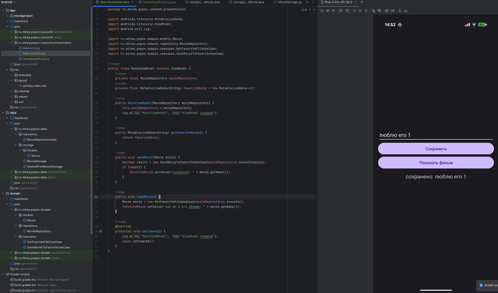

# Практика 3

## Модуль IntentApp

Создан модуль `IntentApp`. В первой активности получено системное время через `SimpleDateFormat`  и передано во вторую с помощью `putExtra`. Во второй активности отображается текст с квадратом номера и временем.

Во второй активности время получается через метод `getStringExtra()` объекта класса `Intent`.

## Модуль Sharer

В модуле Sharer реализован механизм отправки текста с помощью `ACTION_SEND`. Через `createChooser` пользователь выбирает приложение, куда отправить сообщение.

## Модуль FavoriteBook

Создан модуль `FavoriteBook`. Реализован обмен данными между двумя активностями через `ActivityResultLauncher`. Пользователь вводит название книги и цитату, результат отображается на первом экране.

 В главной активности отображается `TextView` с результатом, полученным от пользователя. Во второй активности пользователь вводит название любимой книги и цитату, которые затем возвращаются обратно в первую активность. Также отображается книга и цитата разработчика.

## Модуль SystemIntentsApp

Создан модуль `SystemIntentsApp`, в котором реализованы вызовы стандартных приложений Android через `Intent`.

В приложении размещены три кнопки, каждая из которых запускает одно из системных действий: открытие браузера с сайтом Android Developers, запуск приложения «Телефон» с предустановленным номером, открытие приложения «Карты» с координатами центра Москвы

Для этого используются стандартные действия `Intent.ACTION_VIEW` и `Intent.ACTION_DIAL` с `Uri.parse()`.

## Модуль SimpleFragmentApp

Создано приложение SimpleFragmentApp. Реализована замена фрагментов в зависимости от кнопок. Добавлена адаптивная разметка — в горизонтальной ориентации оба фрагмента отображаются одновременно.

Создан модуль `SimpleFragmentApp`, в котором реализованы два отдельных фрагмента — `FirstFragment` и `SecondFragment`. На главной активности размещены две кнопки для переключения фрагментов. При вертикальной ориентации отображается один фрагмент за раз, при горизонтальной — оба фрагмента размещаются на экране одновременно.

Для этого были созданы два класса `FirstFragment` и `SecondFragment`, наследуемые от `Fragment` Затем была использован `FragmentContainerView` в layout-файле активности. Для отображения в горизонтальном режиме создан еще один layout, куда были помещены оба фрагмента.

## Mirea Project

### **DataFragment**

Во фрагменте `DataFragment` отображается какая-никакая информация о моей любимой отрасли - кибербезопасности.

Фрагмент построен на ScrollView и содержит `TextView` с длинным текстом, описывающим основные направления, задачи и технологии в отрасли.

Используется MaterialCardView, ведь надо косить под Material You.

---

### **WebViewFragment**

Во `WebViewFragment` добавлен компонент `WebView`, позволяющий встроенно отображать сайты без перехода во внешние браузеры.

Была реализована загрузка моего репозитория на гитхабе.

Также добавлена возможность загрузки скриптов через включение `JavaScript` в настройках браузера (`webView.getSettings().setJavaScriptEnabled(true)`), что важно для корректной работы современных сайтов.

В манифесте нужно было обязательно прописать разрешение на использование интернета, чтобы браузер грузил сайты.

---

### **Навигация и маршруты**

В файл `activity_main_drawer.xml` были добавлены новые пункты меню — «Отрасль» и «Браузер», соответствующие добавленным фрагментам.

Также были зарегистрированы маршруты в файле `mobile_navigation.xml`, где прописаны привязки между ID пунктов меню и соответствующими фрагментами.

В `MainActivity` обновлён объект `AppBarConfiguration`, в который добавлены новые ID, чтобы корректно работала кнопка "назад" и отображалось название текущего экрана в верхней панели.

---

На этом выполнение практики 3 закончено.