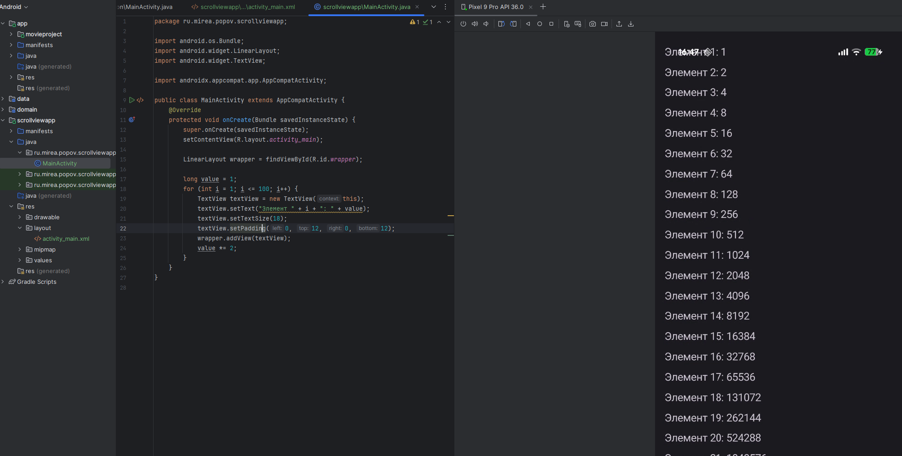

# Практика 4

# ScrollView

В модуле **ScrollViewApp** была создана активити с элементом `ScrollView`, содержащим вертикальный `LinearLayout`. В коде `MainActivity` реализовано динамическое добавление ста текстовых элементов, представляющих геометрическую прогрессию со знаменателем 2. Каждое значение создаётся и добавляется программно в контейнер. Благодаря `ScrollView` пользователь может прокручивать список значений до 100-го элемента.




# ListView

В модуле **ListViewApp** создан экран, отображающий список книг и их авторов. Для реализации списка использован компонент `ListView` и адаптер `ArrayAdapter`, который связывает массив данных с двумя текстовыми элементами каждой строки. Для вывода информации применена встроенная разметка `simple_list_item_2`, позволяющая показать автора и название книги в двух строках. Список содержит более 30 элементов, каждый из которых корректно отображается и прокручивается.


# RecyclerView

В модуле **RecyclerViewApp** реализовано приложение для отображения списка исторических событий. Для этого создана модель `Event`, содержащая название, описание и изображение. Макет элемента оформлен с помощью `CardView` и `ConstraintLayout`. Для связи данных с интерфейсом реализованы `EventAdapter` и `EventViewHolder`. В `MainActivity` создаётся список событий, который передаётся адаптеру и отображается в `RecyclerView`. Благодаря использованию `LinearLayoutManager` обеспечена вертикальная прокрутка и высокая производительность даже при большом количестве элементов.


Event:

```java
package ru.mirea.popov.recylerviewapp;

public class Event {
    private final String title;
    private final String description;
    private final int imageResId;

    public Event(String title, String description, int imageResId) {
        this.title = title;
        this.description = description;
        this.imageResId = imageResId;
    }

    public String getTitle() {
        return title;
    }

    public String getDescription() {
        return description;
    }

    public int getImageResId() {
        return imageResId;
    }
}

```

EventAdapter:

```java
package ru.mirea.popov.recylerviewapp;

import android.view.LayoutInflater;
import android.view.View;
import android.view.ViewGroup;
import androidx.annotation.NonNull;
import androidx.recyclerview.widget.RecyclerView;
import java.util.List;

public class EventAdapter extends RecyclerView.Adapter<EventViewHolder> {
    private final List<Event> events;

    public EventAdapter(List<Event> events) {
        this.events = events;
    }

    @NonNull
    @Override
    public EventViewHolder onCreateViewHolder(@NonNull ViewGroup parent, int viewType) {
        View view = LayoutInflater.from(parent.getContext())
                .inflate(R.layout.item_event, parent, false);
        return new EventViewHolder(view);
    }

    @Override
    public void onBindViewHolder(@NonNull EventViewHolder holder, int position) {
        Event event = events.get(position);
        holder.titleView.setText(event.getTitle());
        holder.descriptionView.setText(event.getDescription());
        holder.imageView.setImageResource(event.getImageResId());
    }

    @Override
    public int getItemCount() {
        return events.size();
    }
}

```

EventViewHolder:

```java
package ru.mirea.popov.recylerviewapp;

import android.view.View;
import android.widget.ImageView;
import android.widget.TextView;
import androidx.recyclerview.widget.RecyclerView;

public class EventViewHolder extends RecyclerView.ViewHolder {
    ImageView imageView;
    TextView titleView;
    TextView descriptionView;

    public EventViewHolder(View itemView) {
        super(itemView);
        imageView = itemView.findViewById(R.id.imageViewEvent);
        titleView = itemView.findViewById(R.id.textViewTitle);
        descriptionView = itemView.findViewById(R.id.textViewDescription);
    }
}

```

# Контрольное

На основе приложения из практики №1 реализовано отображение списка фильмов с использованием архитектуры MVVM. В слое `data` создан репозиторий `MovieRepositoryImpl` с тестовым набором фильмов (mock data). В `domain` уровне определены интерфейс `MovieRepository` и use-case `GetFavoriteFilmUseCase`. В `presentation` реализованы классы `MainViewModel`, `MovieAdapter` и `MainActivity`. Обновление интерфейса выполняется через `LiveData`, наблюдающую за изменениями данных.


### GetFavoriteFilmUseCase:

```java
package ru.mirea.popov.domain.usecases;

import java.util.List;
import ru.mirea.popov.domain.models.Movie;
import ru.mirea.popov.domain.repository.MovieRepository;

public class GetFavoriteFilmUseCase {
    private final MovieRepository repository;

    public GetFavoriteFilmUseCase(MovieRepository repository) {
        this.repository = repository;
    }

    public List<Movie> execute() {
        return repository.getAllMovies();
    }
}

```

### MainViewModel:

```java
package ru.mirea.popov.Lesson9.presentation;

import androidx.lifecycle.LiveData;
import androidx.lifecycle.MutableLiveData;
import androidx.lifecycle.ViewModel;
import java.util.List;
import ru.mirea.popov.data.repository.MovieRepositoryImpl;
import ru.mirea.popov.domain.models.Movie;
import ru.mirea.popov.domain.repository.MovieRepository;
import ru.mirea.popov.domain.usecases.GetFavoriteFilmUseCase;

public class MainViewModel extends ViewModel {
    private final MutableLiveData<List<Movie>> moviesLiveData = new MutableLiveData<>();

    public MainViewModel(MovieRepository repo) {
        loadMovies();
    }

    private void loadMovies() {
        GetFavoriteFilmUseCase useCase = new GetFavoriteFilmUseCase(new MovieRepositoryImpl());
        moviesLiveData.setValue(useCase.execute());
    }

    public LiveData<List<Movie>> getMovies() {
        return moviesLiveData;
    }
}

```

### MovieAdapter:

```java
package ru.mirea.popov.Lesson9.presentation;

import android.view.LayoutInflater;
import android.view.View;
import android.view.ViewGroup;
import android.widget.TextView;
import androidx.annotation.NonNull;
import androidx.recyclerview.widget.RecyclerView;
import java.util.ArrayList;
import java.util.List;
import ru.mirea.popov.Lesson9.R;
import ru.mirea.popov.domain.models.Movie;

public class MovieAdapter extends RecyclerView.Adapter<MovieAdapter.MovieViewHolder> {
    private final List<Movie> movies = new ArrayList<>();

    public void setItems(List<Movie> newMovies) {
        movies.clear();
        movies.addAll(newMovies);
        notifyDataSetChanged();
    }

    @NonNull
    @Override
    public MovieViewHolder onCreateViewHolder(@NonNull ViewGroup parent, int viewType) {
        View view = LayoutInflater.from(parent.getContext())
                .inflate(R.layout.item_movie, parent, false);
        return new MovieViewHolder(view);
    }

    @Override
    public void onBindViewHolder(@NonNull MovieViewHolder holder, int position) {
        Movie movie = movies.get(position);
        holder.title.setText(movie.getTitle());
        holder.genre.setText(movie.getGenre());
        holder.year.setText(String.valueOf(movie.getYear()));
    }

    @Override
    public int getItemCount() {
        return movies.size();
    }

    static class MovieViewHolder extends RecyclerView.ViewHolder {
        TextView title, genre, year;

        MovieViewHolder(View itemView) {
            super(itemView);
            title = itemView.findViewById(R.id.textViewTitle);
            genre = itemView.findViewById(R.id.textViewGenre);
            year = itemView.findViewById(R.id.textViewYear);
        }
    }
}

```

### MainActivity

```java
package ru.mirea.popov.Lesson9.presentation;

import android.os.Bundle;
import androidx.appcompat.app.AppCompatActivity;
import androidx.lifecycle.ViewModelProvider;
import androidx.recyclerview.widget.LinearLayoutManager;
import androidx.recyclerview.widget.RecyclerView;
import ru.mirea.popov.Lesson9.presentation.MainViewModel;
import ru.mirea.popov.Lesson9.R;

public class MainActivity extends AppCompatActivity {

    private MainViewModel viewModel;
    private MovieAdapter adapter;

    @Override
    protected void onCreate(Bundle savedInstanceState) {
        super.onCreate(savedInstanceState);
        setContentView(R.layout.activity_main);

        RecyclerView recyclerView = findViewById(R.id.recyclerViewMovies);
        recyclerView.setLayoutManager(new LinearLayoutManager(this));
        adapter = new MovieAdapter();
        recyclerView.setAdapter(adapter);

        viewModel = new ViewModelProvider(this, new ViewModelFactory())
                .get(MainViewModel.class);
        viewModel.getMovies().observe(this, movies -> adapter.setItems(movies));
    }
}

```

Приложение корректно отображает список фильмов в `RecyclerView`, архитектура разделена на слои, используется `ViewModel` и `ViewModelFactory` для управления жизненным циклом. Передача данных реализована через `LiveData`, что обеспечивает стабильную работу при повороте экрана и других изменениях состояния.

---

На этом выполнение практической работы  4 закончено.