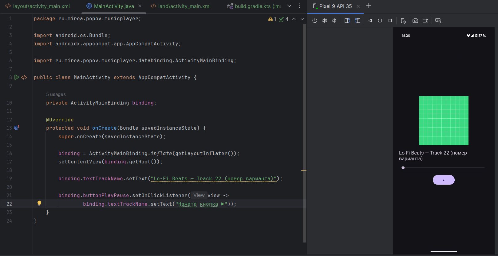

# Практика 4

## Модуль MusicPlayer

В модуле `MusicPlayer` реализован макет экрана музыкального плеера с поддержкой портретной и горизонтальной ориентации.

Использован `ViewBinding`, позволяющий обращаться к элементам без `findViewById`.

В портретной ориентации отображаются обложка, название трека, ползунок и кнопка воспроизведения.

В горизонтальной ориентации добавлены кнопки “предыдущий” и “следующий”, элементы выровнены в горизонтальном LinearLayout.

Назначение кнопок заглушено — реализована только визуальная часть.

## Модуль Thread

В модуле `Thread` реализован расчет среднего количества пар в день. Пользователь вводит общее число пар и количество учебных дней.

После нажатия кнопки запускается фоновый поток, который рассчитывает результат и передаёт его обратно в `TextView` через `Handler`.

Если хотя бы одно поле не заполнено, то вылезет toast-уведомление с требованием это исправить.

Вся инициализация интерфейса выполнена с использованием `ViewBinding`.

## Модуль data_thread

В контрольной части модуля `data_thread` реализована демонстрация последовательности запуска задач в UI-потоке. Использованы методы `runOnUiThread`, `post` и `postDelayed`.

Результат выводится в `TextView`, ограниченный 10 строками. Вывод позволяет сравнить, как методы работают с точки зрения очередности и задержек.

Различия между методами:

`runOnUiThread()` **н**емедленно планирует выполнение кода в основном потоке, если вызван из фонового.

`Handler.post(**)**`: отправляет задачу в очередь сообщений основного потока и выполняет её, когда поток освободится.

`Handler.postDelayed(`): то же самое, но с задержкой.

## Модуль Looper

В контрольной части модуля `looper` реализован ввод возраста и профессии. Значение возраста используется как время задержки (в секундах) в фоновом потоке. По завершении операции результат отображается в логах через `Log.d` и выводится пользователю в `TextView`. Действительно, результата нужно было дожидаться 21 секунду.

## Модуль CryptoLoader

В модуле `cryptoloader` реализовано шифрование строки с использованием алгоритма AES. После ввода текста пользователем операция шифрования выполняется в отдельном потоке через `ExecutorService`, а результат отображается в `TextView`.

Для преобразования данных использованы классы `Cipher`, `SecretKeySpec` и `Base64`. Это задание позволяет отработать работу с криптографией и многопоточностью одновременно.

## Модуль ServiceApp

В модуле `ServiceApp` реализован фоновый музыкальный проигрыватель с использованием `ForegroundService`. . В интерфейсе размещены две кнопки: одна запускает сервис, другая его останавливает. Вся работа с интерфейсом выполнена через `ViewBinding`.

Проигрывание реализовано внутри класса `MusicService`, где создаётся экземпляр `MediaPlayer`, запускается воспроизведение и вызывается `startForeground()` с уведомлением. Для корректной работы на андроиде выше 13 версии были добавлены разрешения `FOREGROUND_SERVICE` и `POST_NOTIFICATIONS`, а также реализован запрос разрешения через `requestPermissions()`.

Также был создан `NotificationChannel`, связанный с `NotificationCompat.Builder`. В уведомлении указано название собственной композиции (я не совсем понял значение слова “собственной”). Уведомление работает даже при свёрнутом приложении, а `MediaPlayer` работает в фоне благодаря запуску через `startForeground()` и указанию `android:foregroundServiceType="mediaPlayback"` в манифесте.

## Модуль WorkManager

В модуле `WorkManager` реализован отложенный запуск фоновой задачи с использованием API `WorkManager` из библиотеки AndroidX. Задача запускается нажатием кнопки, а выполнение происходит только при соблюдении заданных условий: устройство должно находиться на зарядке и быть подключено к сети без тарификации (Wi-Fi или безлимитный интернет). Эти критерии заданы через класс `Constraints` с помощью `setRequiresCharging(true)` и `setRequiredNetworkType(NetworkType.UNMETERED)`.

Фоновая логика размещена в классе `MyWorker`, который наследует `Worker`. Внутри метода `doWork()` реализована имитация задержки через `Thread.sleep(10000)`, а начало и завершение работы логируются в `Logcat`.

Если подключения к вай-фаю нет, то высвечивается статус ENQUEUED.

Как только подключение появляется, статус меняется на RUNNING, а через 10 секунд становится SUCCEEDED, как и должно быть.

## MireaProject

В рамках расширения `MireaProject` добавлен новый фрагмент `PracticeFragment`, отображающий результат выполнения фоновой задачи. Фоновую задачу выполняет простой воркер, который выполняет пятисекундное ожидание в фоне.

При нажатии кнопки запускается задача через `WorkManager`, внутри которой с помощью `PractiveWorker` имитируется вычисление отчета о прохождении практики.

После завершения задачи результат отображается в `TextView`, а в `Logcat` фиксируются сообщения начала и конца работы. Таким образом реализовано выполнение логики фрагмента с применением механизма `Worker`.

---

На этом выполнение практики 4 окончено.