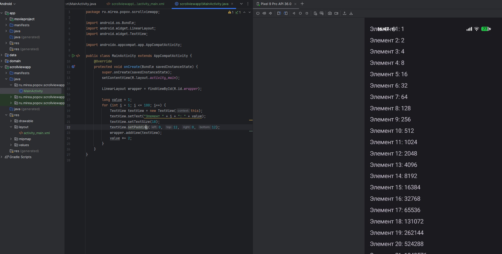

# Практика 4

# ScrollView

В модуле **ScrollViewApp** была создана активити с элементом `ScrollView`, содержащим вертикальный `LinearLayout`. В коде `MainActivity` реализовано динамическое добавление ста текстовых элементов, представляющих геометрическую прогрессию со знаменателем 2. Каждое значение создаётся и добавляется программно в контейнер. Благодаря `ScrollView` пользователь может прокручивать список значений до 100-го элемента.




# ListView

В модуле **ListViewApp** создан экран, отображающий список книг и их авторов. Для реализации списка использован компонент `ListView` и адаптер `ArrayAdapter`, который связывает массив данных с двумя текстовыми элементами каждой строки. Для вывода информации применена встроенная разметка `simple_list_item_2`, позволяющая показать автора и название книги в двух строках. Список содержит более 30 элементов, каждый из которых корректно отображается и прокручивается.


# RecyclerView

В модуле **RecyclerViewApp** реализовано приложение для отображения списка исторических событий. Для этого создана модель `Event`, содержащая название, описание и изображение. Макет элемента оформлен с помощью `CardView` и `ConstraintLayout`. Для связи данных с интерфейсом реализованы `EventAdapter` и `EventViewHolder`. В `MainActivity` создаётся список событий, который передаётся адаптеру и отображается в `RecyclerView`. Благодаря использованию `LinearLayoutManager` обеспечена вертикальная прокрутка и высокая производительность даже при большом количестве элементов.


Event:

```java
package ru.mirea.popov.recylerviewapp;

public class Event {
    private final String title;
    private final String description;
    private final int imageResId;

    public Event(String title, String description, int imageResId) {
        this.title = title;
        this.description = description;
        this.imageResId = imageResId;
    }

    public String getTitle() {
        return title;
    }

    public String getDescription() {
        return description;
    }

    public int getImageResId() {
        return imageResId;
    }
}

```

EventAdapter:

```java
package ru.mirea.popov.recylerviewapp;

import android.view.LayoutInflater;
import android.view.View;
import android.view.ViewGroup;
import androidx.annotation.NonNull;
import androidx.recyclerview.widget.RecyclerView;
import java.util.List;

public class EventAdapter extends RecyclerView.Adapter<EventViewHolder> {
    private final List<Event> events;

    public EventAdapter(List<Event> events) {
        this.events = events;
    }

    @NonNull
    @Override
    public EventViewHolder onCreateViewHolder(@NonNull ViewGroup parent, int viewType) {
        View view = LayoutInflater.from(parent.getContext())
                .inflate(R.layout.item_event, parent, false);
        return new EventViewHolder(view);
    }

    @Override
    public void onBindViewHolder(@NonNull EventViewHolder holder, int position) {
        Event event = events.get(position);
        holder.titleView.setText(event.getTitle());
        holder.descriptionView.setText(event.getDescription());
        holder.imageView.setImageResource(event.getImageResId());
    }

    @Override
    public int getItemCount() {
        return events.size();
    }
}

```

EventViewHolder:

```java
package ru.mirea.popov.recylerviewapp;

import android.view.View;
import android.widget.ImageView;
import android.widget.TextView;
import androidx.recyclerview.widget.RecyclerView;

public class EventViewHolder extends RecyclerView.ViewHolder {
    ImageView imageView;
    TextView titleView;
    TextView descriptionView;

    public EventViewHolder(View itemView) {
        super(itemView);
        imageView = itemView.findViewById(R.id.imageViewEvent);
        titleView = itemView.findViewById(R.id.textViewTitle);
        descriptionView = itemView.findViewById(R.id.textViewDescription);
    }
}

```

#