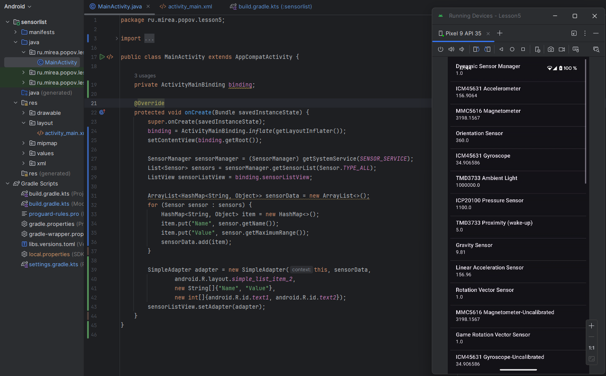

# Практика 5

## Модуль SensorList

Создал новый модуль с названием `sensorlist`. В `activity_main.xml` добавлен элемент `ListView`, в котором отображаются названия всех сенсоров устройства и их максимальный диапазон. Список получен через `SensorManager.getSensorList(Sensor.TYPE_ALL)`. 

Для отображения данных используется `SimpleAdapter`, где каждая строка содержит имя сенсора и его значение диапазона. Для доступа к сенсорам использован системный сервис `SENSOR_SERVICE`. Всё реализовано с использованием `ViewBinding`.

## Модуль Accelerometer

В этой задаче был реализован экран для отображения данных с акселерометра на устройстве Android. Для этого был использован класс `SensorManager`, который управляет доступом к сенсорам устройства. В методах `onResume` и `onPause` регистрируется и отписывается от события сенсора, что позволяет эффективно управлять ресурсами. При изменении показаний акселерометра, значения по осям X, Y и Z отображаются в соответствующих текстовых полях, что позволяет отслеживать изменения в реальном времени.

Телефон изначально лежал на крышке. Я его перевернул на дисплей и значение `Roll` стало отрицательным, но с примерно тем же значением, как и должно быть.

## Модуль Camera

В этом задании реализовано приложение, позволяющее снимать фото с помощью системного приложения камеры. При старте осуществляется проверка разрешений на камеру и файловую систему. 

Для безопасного доступа к файлам используется `FileProvider`, который настроен в `AndroidManifest.xml` и `paths.xml`. При нажатии на `ImageView` открывается камера, снимок сохраняется в `externalFilesDir`, затем отображается в `ImageView`. Использован `ActivityResultLauncher` для обработки результата.

## Модуль AudioRecord

Создан модуль `AudioRecord` с двумя кнопками для записи и воспроизведения звука. Использован `MediaRecorder` для захвата аудио с микрофона и сохранения в формате `.3gp` во внутреннюю директорию `Music`.  В манифесте прописано использование разрешения `android.permission.RECORD_AUDIO`.

Для воспроизведения используется `MediaPlayer`, считывающий ранее записанный файл. Добавлена проверка и запрос разрешения `RECORD_AUDIO` через `ContextCompat` и `ActivityCompat`. Кнопки меняют текст и блокируют друг друга, чтобы исключить одновременную запись и воспроизведение.  После начала записи кнопка “Start playing” перестает быть активной, а вместо “Start recording” написано “Stop recording.”

## MireaProject

Добавлен фрагмент `PermissionFragment`, в котором реализован запрос на получение разрешений `CAMERA`, `RECORD_AUDIO` и `WRITE_EXTERNAL_STORAGE`. Проверка осуществляется через `ContextCompat.checkSelfPermission`, а при необходимости разрешения запрашиваются с помощью `ActivityCompat.requestPermissions`. После запроса вызывается метод `onRequestPermissionsResult`, в котором проверяется результат. Все разрешения отображаются пользователю и могут быть выданы вручную через кнопку.

Добавлен фрагмент `SensorNorthFragment`, реализующий определение направления на север с помощью датчиков магнитного поля и акселерометра. Для вычисления направления используется `SensorManager.getRotationMatrix` и `getOrientation`. На экране отображается стрелка (на данный момент иконка камеры), которая плавно поворачивается в направлении севера. Визуализация реализована с помощью `RotateAnimation`, применяемой к `ImageView`.

Добавлен фрагмент `CameraNoteFragment`, реализующий создание заметки с помощью камеры. При нажатии на кнопку запускается системное приложение камеры с использованием `FileProvider`, сделанное фото сохраняется во внутреннюю директорию и отображается в `ImageView`. Пользователь также может ввести описание в `EditText`. Файл создаётся с уникальным именем на основе времени.

Добавлен фрагмент `MicTaskFragment`, реализующий запись голосовой заметки с помощью `MediaRecorder`. При нажатии на кнопку начинается запись звука во внутреннюю директорию приложения, по нажатию повторно — запись останавливается. После завершения отображается статус "Запись завершена". Запрос разрешения на `RECORD_AUDIO` реализован при первом запуске фрагмента. Файл сохраняется в формате `.3gp`.

---

На этом выполнение практики 5 закончено.
