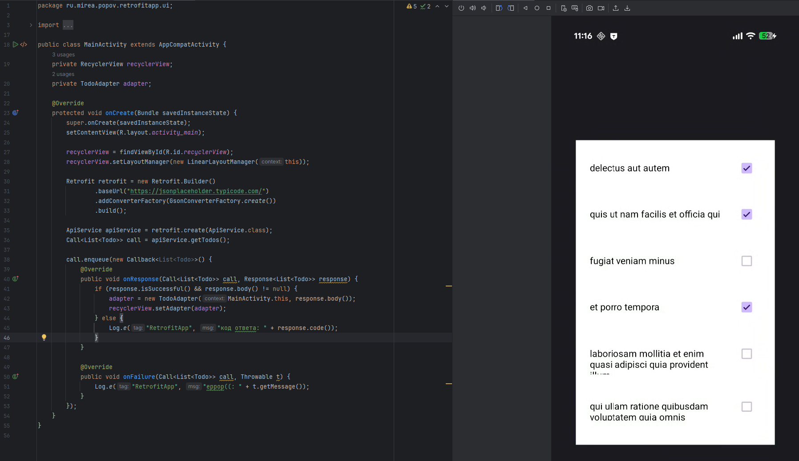

# Практика 5

# RetrofitApp

В ходе выполнения практической работы была реализована мобильная программа **RetrofitApp**, демонстрирующая работу с сетевыми запросами в Android. В проект был добавлен модуль Retrofit и настроен конвертер Gson для обработки JSON-ответов.



Приложение получает список задач (todos) с публичного API `https://jsonplaceholder.typicode.com/todos` и отображает их с помощью RecyclerView. Каждый элемент списка содержит название задачи и флажок состояния выполнения.


При изменении состояния чекбокса отправляется PUT-запрос на сервер для обновления соответствующей записи. Таким образом, реализовано полное взаимодействие клиента с сервером по принципу REST API, включая асинхронную загрузку данных и их обновление.

### ApiService:

```java
package ru.mirea.popov.retrofitapp.data;

import java.util.List;
import retrofit2.Call;
import retrofit2.http.Body;
import retrofit2.http.GET;
import retrofit2.http.PUT;
import retrofit2.http.Path;

public interface ApiService {
    @GET("todos")
    Call<List<Todo>> getTodos();

    @PUT("todos/{id}")
    Call<Todo> updateTodo(@Path("id") int id, @Body Todo todo);
}

```

### Todo:

```java
package ru.mirea.popov.retrofitapp.data;

import com.google.gson.annotations.Expose;
import com.google.gson.annotations.SerializedName;

public class Todo {
    @SerializedName("userId")
    @Expose
    private Integer userId;
    @SerializedName("id")
    @Expose
    private Integer id;
    @SerializedName("title")
    @Expose
    private String title;
    @SerializedName("completed")
    @Expose
    private Boolean completed;

    public Integer getUserId() {
        return userId;
    }

    public Integer getId() {
        return id;
    }

    public String getTitle() {
        return title;
    }

    public Boolean getCompleted() {
        return completed;
    }

    public void setCompleted(Boolean completed) {
        this.completed = completed;
    }
}

```

### TodoViewHolder:

```java
package ru.mirea.popov.retrofitapp.ui;

import android.view.View;
import android.widget.CheckBox;
import android.widget.TextView;
import androidx.recyclerview.widget.RecyclerView;
import ru.mirea.popov.retrofitapp.R;

public class TodoViewHolder extends RecyclerView.ViewHolder {
    TextView textViewTitle;
    CheckBox checkBoxCompleted;

    public TodoViewHolder(View itemView) {
        super(itemView);
        textViewTitle = itemView.findViewById(R.id.textViewTitle);
        checkBoxCompleted = itemView.findViewById(R.id.checkBoxCompleted);
    }
}

```

---

# Picasso

Для расширения функционала приложения был реализован модуль работы с изображениями при помощи библиотеки **Picasso**. В каждый элемент списка дел добавлено изображение, загружаемое по сети с сервиса `https://picsum.photos`. Picasso осуществляет асинхронную загрузку изображений, кэширует их в памяти и на диске, а также обеспечивает автоматическую обработку ошибок. При этом приложение остаётся отзывчивым, так как загрузка выполняется в отдельном потоке. Для каждого элемента списка отображается уникальная картинка, связанная с идентификатором задачи. Таким образом, реализована интеграция сетевой загрузки изображений с основным функционалом RetrofitApp.


### Обновленный TodoAdapter:

```java
package ru.mirea.popov.retrofitapp.ui;

import android.content.Context;
import android.util.Log;
import android.widget.CompoundButton;
import android.view.LayoutInflater;
import android.view.View;
import android.view.ViewGroup;
import androidx.annotation.NonNull;
import androidx.recyclerview.widget.RecyclerView;
import com.squareup.picasso.Picasso;
import java.util.List;
import retrofit2.Call;
import retrofit2.Callback;
import retrofit2.Response;
import ru.mirea.popov.retrofitapp.R;
import ru.mirea.popov.retrofitapp.data.ApiService;
import ru.mirea.popov.retrofitapp.data.Todo;
import retrofit2.Retrofit;
import retrofit2.converter.gson.GsonConverterFactory;

public class TodoAdapter extends RecyclerView.Adapter<TodoViewHolder> {
    private List<Todo> todos;
    private Context context;
    private ApiService apiService;

    public TodoAdapter(Context context, List<Todo> todos) {
        this.context = context;
        this.todos = todos;

        Retrofit retrofit = new Retrofit.Builder()
                .baseUrl("https://jsonplaceholder.typicode.com/")
                .addConverterFactory(GsonConverterFactory.create())
                .build();
        apiService = retrofit.create(ApiService.class);
    }

    @NonNull
    @Override
    public TodoViewHolder onCreateViewHolder(@NonNull ViewGroup parent, int viewType) {
        View view = LayoutInflater.from(context).inflate(R.layout.item, parent, false);
        return new TodoViewHolder(view);
    }

    @Override
    public void onBindViewHolder(@NonNull TodoViewHolder holder, int position) {
        Todo todo = todos.get(position);
        holder.textViewTitle.setText(todo.getTitle());
        holder.checkBoxCompleted.setOnCheckedChangeListener(null);
        holder.checkBoxCompleted.setChecked(todo.getCompleted());

        String imageUrl = "https://picsum.photos/200?random=" + todo.getId();
        Picasso.get()
                .load(imageUrl)
                .placeholder(R.drawable.ic_launcher_foreground)
                .error(R.drawable.ic_launcher_foreground)
                .resize(100, 100)
                .centerCrop()
                .into(holder.imageViewAvatar);

        holder.checkBoxCompleted.setOnCheckedChangeListener((CompoundButton buttonView, boolean isChecked) -> {
            todo.setCompleted(isChecked);
            Call<Todo> call = apiService.updateTodo(todo.getId(), todo);
            call.enqueue(new Callback<Todo>() {
                @Override
                public void onResponse(Call<Todo> call, Response<Todo> response) {
                    if (response.isSuccessful()) {
                        Log.d("RetrofitApp", "обновлено: " + todo.getTitle());
                    } else {
                        Log.e("RetrofitApp", "ошибка обновления: " + response.code());
                    }
                }

                @Override
                public void onFailure(Call<Todo> call, Throwable t) {
                    Log.e("RetrofitApp", "еррор((: " + t.getMessage());
                }
            });
        });
    }

    @Override
    public int getItemCount() {
        return todos.size();
    }
}

```

---

# Контрольное

Теперь при нажатии кнопки “обновить” прилетают данные с [openweathermap.org](http://openweathermap.org)  по их API и отображаются вместе с иконкой в приложении.


## Измененные и новые файлы

### WeatherApi.java

Создан интерфейс сетевого взаимодействия `WeatherApi`, описывающий методы обращения к REST API OpenWeatherMap.

Добавлен запрос `getWeather()`, аннотированный `@GET("data/2.5/weather")`, с параметрами `q`, `appid`, `units`, `lang`.

Интерфейс возвращает объект `Call<WeatherResponse>`, содержащий погодные данные в формате JSON.

```java
package ru.mirea.popov.data.network;

import retrofit2.Call;
import retrofit2.http.GET;
import retrofit2.http.Query;
import ru.mirea.popov.data.network.models.WeatherResponse;

public interface WeatherApi {
    @GET("data/2.5/weather")
    Call<WeatherResponse> getWeather(
            @Query("q") String city,
            @Query("appid") String apiKey,
            @Query("units") String units,
            @Query("lang") String lang
    );
}

```

### WeatherNetworkSource.java

Добавлен класс, выполняющий инициализацию клиента **Retrofit**.

Настроен `Retrofit.Builder` с базовым URL `https://api.openweathermap.org/` и конвертером `GsonConverterFactory`.

Класс обеспечивает единый доступ к API и создаёт экземпляр `WeatherApi` через метод `create()`.

```java
package ru.mirea.popov.data.network;

import retrofit2.Retrofit;
import retrofit2.converter.gson.GsonConverterFactory;

public class WeatherNetworkSource {
    private static Retrofit retrofit;

    public static WeatherApi api() {
        if (retrofit == null) {
            retrofit = new Retrofit.Builder()
                    .baseUrl("https://api.openweathermap.org/")
                    .addConverterFactory(GsonConverterFactory.create())
                    .build();
        }
        return retrofit.create(WeatherApi.class);
    }
}

```

### WeatherResponse.java

Создана модель для десериализации JSON-ответа от API.

Использованы аннотации `@SerializedName` из библиотеки **Gson**.

Структура включает поля `cityName`, `main.temp`, `weather[].description`, `weather[].icon`.

Модель упрощает преобразование JSON в объекты Java для дальнейшей работы с ними в репозитории.

```java
package ru.mirea.popov.data.network.models;

import com.google.gson.annotations.SerializedName;

public class WeatherResponse {
    @SerializedName("name")
    public String cityName;

    @SerializedName("main")
    public Main main;

    @SerializedName("weather")
    public Weather[] weather;

    public static class Main {
        @SerializedName("temp")
        public double temp;
    }

    public static class Weather {
        @SerializedName("description")
        public String description;
        @SerializedName("icon")
        public String icon;
    }
}

```

### WeatherRepositoryImpl.java

Репозиторий дополнен методом `fetchWeatherFromApi(String city)`, который выполняет сетевой запрос через Retrofit.

При успешном ответе данные десериализуются в объект `WeatherResponse`, из которого формируется `WeatherInfo`.

Результат сохраняется в таблицу Room (`WeatherEntity`), включая код иконки погоды.

Репозиторий также обрабатывает возможные исключения (например, отсутствие сети) и возвращает безопасный объект `WeatherInfo` с текстом “Ошибка подключения”.

Таким образом, репозиторий объединяет три источника данных: API (Retrofit), Room (история запросов), SharedPreferences (последний выбранный город).

```java
package ru.mirea.popov.data.repository;

import android.content.Context;
import android.util.Log;

import androidx.lifecycle.LiveData;
import androidx.room.Room;

import org.json.JSONObject;

import java.time.LocalDate;
import java.util.List;

import retrofit2.Call;
import retrofit2.Response;

import ru.mirea.popov.data.db.AppDatabase;
import ru.mirea.popov.data.db.WeatherEntity;
import ru.mirea.popov.data.network.WeatherApi;
import ru.mirea.popov.data.network.WeatherNetworkSource;
import ru.mirea.popov.data.network.models.WeatherResponse;
import ru.mirea.popov.data.storage.PreferencesStorage;
import ru.mirea.popov.domain.models.WeatherInfo;
import ru.mirea.popov.domain.repository.WeatherRepository;

public class WeatherRepositoryImpl implements WeatherRepository {
    private final PreferencesStorage prefs;
    private final AppDatabase db;

    public WeatherRepositoryImpl(Context context, ru.mirea.popov.data.network.WeatherApi unused, PreferencesStorage prefs) {
        this.prefs = prefs;
        this.db = Room.databaseBuilder(context, AppDatabase.class, "weather_db").fallbackToDestructiveMigration().build();
    }

    @Override
    public WeatherInfo getWeather(String city) {
        JSONObject json = null;
        return new WeatherInfo(city, 0, "недоступно(", "");
    }

    @Override
    public void saveFavoriteCity(String city) {
        prefs.saveCity(city);
    }

    public WeatherInfo fetchWeatherFromApi(String city) {
        try {
            Log.d("WeatherAPI", "fetchWeatherFromApi: старт запроса");
            WeatherApi api = WeatherNetworkSource.api();
            Call<WeatherResponse> call = api.getWeather(city, "24e284d429fb1602e2f1c492919f4ed3", "metric", "ru");
            Response<WeatherResponse> response = call.execute();
            Log.d("WeatherAPI", "fetchWeatherFromApi: ответ получен");

            if (response.isSuccessful() && response.body() != null) {
                WeatherResponse data = response.body();
                String desc = data.weather != null && data.weather.length > 0 ? data.weather[0].description : "";
                String icon = data.weather != null && data.weather.length > 0 ? data.weather[0].icon : "";
                double temp = data.main != null ? data.main.temp : 0.0;
                Log.d("WeatherAPI", "успешный ответ: " + desc + " (" + temp + "°C)");

                WeatherInfo info = new WeatherInfo(data.cityName, temp, desc, icon);
                db.weatherDao().insert(new WeatherEntity(info.getCity(), info.getTemperature(), info.getDescription(), LocalDate.now().toString(), info.getIconCode()));
                return info;
            } else {
                Log.e("WeatherAPI", "ошибка HTTP: " + response.code());
            }
        } catch (Exception e) {
            Log.e("WeatherAPI", "исключение в fetchWeatherFromApi()", e);
        }
        return new WeatherInfo(city, 0, "ошибка подключения", "");
    }

    public LiveData<List<WeatherEntity>> getAllWeatherLive() {
        return db.weatherDao().getAllWeatherLive();
    }
}

```

### WeatherInfo.java

Модель доменного слоя расширена полем `iconCode`, в котором хранится код иконки погоды (например, `"04d"`).

Поле используется для загрузки соответствующей картинки с сервера OpenWeatherMap и визуализации погодного состояния.

Теперь `WeatherInfo` содержит все ключевые данные — город, температуру, описание и код иконки.

```java
package ru.mirea.popov.domain.models;

public class WeatherInfo {
    private final String city;
    private final double temperature;
    private final String description;
    private final String iconCode;

    public WeatherInfo(String city, double temperature, String description, String iconCode) {
        this.city = city;
        this.temperature = temperature;
        this.description = description;
        this.iconCode = iconCode;
    }

    public String getCity() { return city; }
    public double getTemperature() { return temperature; }
    public String getDescription() { return description; }
    public String getIconCode() { return iconCode; }
}

```

### WeatherViewModel.java

ViewModel дополнена методом `loadWeatherFromApi()`, который вызывает `repository.fetchWeatherFromApi()` в отдельном потоке `ExecutorService`.

Данные сохраняются в `MediatorLiveData<WeatherInfo>`, что позволяет фрагменту автоматически обновлять интерфейс при изменении состояния.

Добавлен `MutableLiveData<Boolean>` для отображения статуса загрузки (progress bar).

Таким образом, ViewModel теперь полностью координирует работу между UI, репозиторием и источниками данных.

```java
package ru.mirea.popov.weatherproject.presentation;

import android.util.Log;

import androidx.lifecycle.LiveData;
import androidx.lifecycle.MediatorLiveData;
import androidx.lifecycle.MutableLiveData;
import androidx.lifecycle.ViewModel;

import java.util.List;
import java.util.concurrent.ExecutorService;
import java.util.concurrent.Executors;

import ru.mirea.popov.data.db.WeatherEntity;
import ru.mirea.popov.data.repository.WeatherRepositoryImpl;
import ru.mirea.popov.domain.models.WeatherInfo;
import ru.mirea.popov.domain.usecases.GetWeatherUseCase;
import ru.mirea.popov.domain.usecases.SaveFavoriteCityUseCase;

public class WeatherViewModel extends ViewModel {
    private final GetWeatherUseCase getWeatherUseCase;
    private final SaveFavoriteCityUseCase saveFavoriteCityUseCase;
    private final WeatherRepositoryImpl repository;

    private final ExecutorService executor = Executors.newSingleThreadExecutor();

    private final MutableLiveData<Boolean> loading = new MutableLiveData<>(false);
    private final MediatorLiveData<WeatherInfo> weather = new MediatorLiveData<>();

    public WeatherViewModel(GetWeatherUseCase getWeatherUseCase, SaveFavoriteCityUseCase saveFavoriteCityUseCase, WeatherRepositoryImpl repository) {
        this.getWeatherUseCase = getWeatherUseCase;
        this.saveFavoriteCityUseCase = saveFavoriteCityUseCase;
        this.repository = repository;
    }

    public MutableLiveData<Boolean> getLoading() { return loading; }
    public MediatorLiveData<WeatherInfo> getWeather() { return weather; }
    public LiveData<List<WeatherEntity>> getWeatherHistory() { return repository.getAllWeatherLive(); }

    public void loadWeatherFromApi(String city) {
        loading.postValue(true);
        Log.d("WeatherAPI", "ViewModel: запускаю executor для " + city);
        executor.execute(() -> {
            Log.d("WeatherAPI", "Executor: начал выполнение запроса");
            WeatherInfo info = repository.fetchWeatherFromApi(city);
            Log.d("WeatherAPI", "Executor: запрос завершён");
            weather.postValue(info);
            saveFavoriteCityUseCase.execute(city);
            loading.postValue(false);
        });
    }
}

```

### WeatherViewModelFactory.java

Фабрика обновлена для корректного создания экземпляра `WeatherViewModel` с передачей всех зависимостей.

В методе `create()` инициализируются `WeatherRepositoryImpl`, `GetWeatherUseCase` и `SaveFavoriteCityUseCase`, которые передаются в конструктор ViewModel.

```java
package ru.mirea.popov.weatherproject.presentation;

import android.content.Context;

import androidx.annotation.NonNull;
import androidx.lifecycle.ViewModel;
import androidx.lifecycle.ViewModelProvider;

import ru.mirea.popov.data.network.WeatherApi;
import ru.mirea.popov.data.network.WeatherNetworkSource;
import ru.mirea.popov.data.repository.WeatherRepositoryImpl;
import ru.mirea.popov.data.storage.PreferencesStorage;
import ru.mirea.popov.domain.usecases.GetWeatherUseCase;
import ru.mirea.popov.domain.usecases.SaveFavoriteCityUseCase;

public class WeatherViewModelFactory implements ViewModelProvider.Factory {
    private final Context context;

    public WeatherViewModelFactory(Context context) {
        this.context = context;
    }

    @NonNull
    @Override
    public <T extends ViewModel> T create(@NonNull Class<T> modelClass) {
        PreferencesStorage prefs = new PreferencesStorage(context);
        WeatherApi api = WeatherNetworkSource.api();
        WeatherRepositoryImpl repo = new WeatherRepositoryImpl(context, api, prefs);
        return (T) new WeatherViewModel(new GetWeatherUseCase(repo), new SaveFavoriteCityUseCase(repo), repo);
    }
}

```

### WeatherFragment.java

Главный экран приложения переработан для работы с LiveData и Retrofit.

При нажатии кнопки “Обновить” выполняется загрузка данных через ViewModel.

На экране отображаются город, температура, описание и **иконка погоды**, загружаемая с помощью **Picasso** по адресу:

Во время выполнения сетевого запроса отображается `ProgressBar`, а кнопки временно блокируются.

При успешном ответе данные обновляются мгновенно, при ошибке выводится сообщение “Ошибка подключения”.

```java
package ru.mirea.popov.weatherproject.presentation;

import android.os.Bundle;
import android.util.Log;
import android.view.LayoutInflater;
import android.view.View;
import android.view.ViewGroup;
import android.widget.Button;
import android.widget.ImageView;
import android.widget.ProgressBar;
import android.widget.TextView;

import androidx.fragment.app.Fragment;
import androidx.lifecycle.ViewModelProvider;

import com.squareup.picasso.Picasso;

import java.time.LocalTime;

import ru.mirea.popov.domain.models.WeatherInfo;
import ru.mirea.popov.weatherproject.R;

public class WeatherFragment extends Fragment {
    private WeatherViewModel vm;
    private TextView textCity, textTemp, textDesc, textUpdated;
    private ProgressBar progressBar;
    private Button buttonRefresh, buttonHistory;
    private ImageView imageWeatherIcon;

    @Override
    public View onCreateView(LayoutInflater inflater, ViewGroup container, Bundle savedInstanceState) {
        View view = inflater.inflate(R.layout.fragment_weather, container, false);

        imageWeatherIcon = view.findViewById(R.id.imageWeatherIcon);
        textCity = view.findViewById(R.id.textCity);
        textTemp = view.findViewById(R.id.textTemp);
        textDesc = view.findViewById(R.id.textDesc);
        textUpdated = view.findViewById(R.id.textUpdated);
        progressBar = view.findViewById(R.id.progressBar);
        buttonRefresh = view.findViewById(R.id.buttonRefresh);
        buttonHistory = view.findViewById(R.id.buttonHistory);

        vm = new ViewModelProvider(requireActivity(), new WeatherViewModelFactory(requireContext())).get(WeatherViewModel.class);

        vm.getWeather().observe(getViewLifecycleOwner(), this::updateUI);
        vm.getLoading().observe(getViewLifecycleOwner(), isLoading -> {
            progressBar.setVisibility(isLoading ? View.VISIBLE : View.GONE);
            buttonRefresh.setEnabled(!isLoading);
        });

        buttonRefresh.setOnClickListener(v -> {
            Log.d("WeatherAPI", "нажата кнопка обновить");
            vm.loadWeatherFromApi("Москва");
        });
        buttonHistory.setOnClickListener(v -> openHistory());

        return view;
    }

    private void updateUI(WeatherInfo info) {
        if (info == null) return;
        textCity.setText(info.getCity());
        textTemp.setText(String.format("%.1f°C", info.getTemperature()));
        textDesc.setText(info.getDescription());
        if (info.getIconCode() != null && !info.getIconCode().isEmpty()) {
            String url = "https://openweathermap.org/img/wn/" + info.getIconCode() + "@2x.png";
            Picasso.get().load(url).into(imageWeatherIcon);
        }
        textUpdated.setText("последнее обновление: " + LocalTime.now().withNano(0));
    }

    private void openHistory() {
        requireActivity().getSupportFragmentManager()
                .beginTransaction()
                .replace(R.id.fragmentContainer, new HistoryFragment())
                .addToBackStack(null)
                .commit();
    }
}

```

### WeatherHistoryAdapter.java

Адаптер списка истории доработан для отображения иконок погоды.

В методе `onBindViewHolder()` для каждого элемента вызывается:

Теперь каждая карточка истории содержит не только текст, но и изображение погоды, что делает интерфейс более информативным.

```java
package ru.mirea.popov.weatherproject.presentation;

import android.view.LayoutInflater;
import android.view.View;
import android.view.ViewGroup;
import android.widget.ImageView;
import android.widget.TextView;

import androidx.annotation.NonNull;
import androidx.recyclerview.widget.RecyclerView;

import com.squareup.picasso.Picasso;

import java.util.ArrayList;
import java.util.List;

import ru.mirea.popov.data.db.WeatherEntity;
import ru.mirea.popov.weatherproject.R;

public class WeatherHistoryAdapter extends RecyclerView.Adapter<WeatherHistoryAdapter.ViewHolder> {
    private List<WeatherEntity> items = new ArrayList<>();

    public void setItems(List<WeatherEntity> newItems) {
        this.items = newItems;
        notifyDataSetChanged();
    }

    @NonNull
    @Override
    public ViewHolder onCreateViewHolder(@NonNull ViewGroup parent, int viewType) {
        View v = LayoutInflater.from(parent.getContext()).inflate(R.layout.item_history, parent, false);
        return new ViewHolder(v);
    }

    @Override
    public void onBindViewHolder(@NonNull ViewHolder holder, int position) {
        WeatherEntity e = items.get(position);
        holder.city.setText(e.city);
        holder.temp.setText(String.format("%.1f°C", e.temperature));
        holder.date.setText(e.date);
        if (e.icon != null && !e.icon.isEmpty()) {
            String url = "https://openweathermap.org/img/wn/" + e.icon + "@2x.png";
            Picasso.get().load(url).into(holder.icon);
        }
    }

    @Override
    public int getItemCount() {
        return items.size();
    }

    static class ViewHolder extends RecyclerView.ViewHolder {
        ImageView icon;
        TextView city, temp, date;
        ViewHolder(View itemView) {
            super(itemView);
            icon = itemView.findViewById(R.id.iconHistory);
            city = itemView.findViewById(R.id.textCityHistory);
            temp = itemView.findViewById(R.id.textTempHistory);
            date = itemView.findViewById(R.id.textDateHistory);
        }
    }
}

```

### RoomWeatherDao.java

Добавлен метод `getAllWeatherLive()`, возвращающий `LiveData<List<WeatherEntity>>`.

Это позволяет экрану истории автоматически обновляться при появлении новых записей без перезапуска фрагмента.

```java
package ru.mirea.popov.data.storage;

import androidx.lifecycle.LiveData;
import androidx.room.Dao;
import androidx.room.Insert;
import androidx.room.Query;

import java.util.List;

import ru.mirea.popov.data.db.WeatherEntity;

@Dao
public interface RoomWeatherDao {
    @Insert
    void insert(WeatherEntity weather);

    @Query("SELECT * FROM weather_history ORDER BY id DESC LIMIT 5")
    List<WeatherEntity> getLastWeather();

    @Query("SELECT * FROM weather_history ORDER BY id DESC")
    LiveData<List<WeatherEntity>> getAllWeatherLive();
}

```

---

На этом выполнение практической работы 5 закончено.