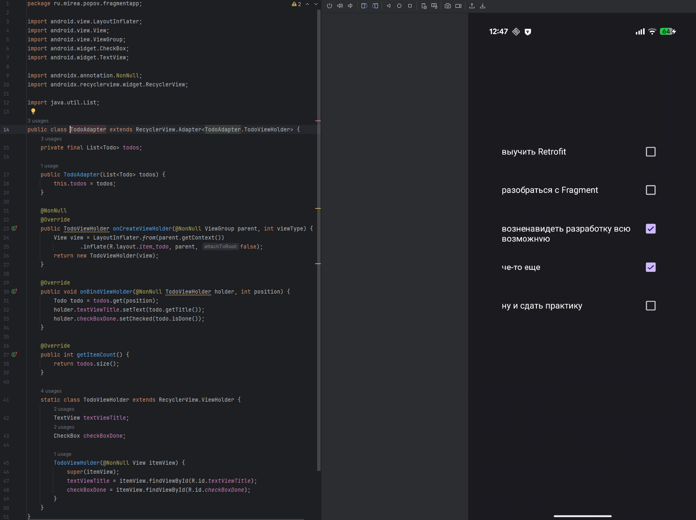

# Практика 6 (2 сем)

# FragmentApp

В этом задании нужно было использовать фрагменты, что и было сделано.



Главная активность содержит `FragmentContainerView`, в который при запуске добавляется фрагмент `TodoListFragment`.

Внутри фрагмента реализован `RecyclerView`, отображающий список дел и их статус выполнения.

Каждый элемент списка представлен в виде текстового поля и чекбокса, разметка выполнена в отдельном файле `item_todo.xml`.


Фрагмент был добавлен в активность программно с помощью `FragmentManager`.

Реализация позволила закрепить принципы модульности интерфейса и раздельной логики отображения через фрагменты.

### MainActivity

```java
package ru.mirea.popov.fragmentapp;

import android.os.Bundle;
import androidx.appcompat.app.AppCompatActivity;

public class MainActivity extends AppCompatActivity {
    @Override
    protected void onCreate(Bundle savedInstanceState) {
        super.onCreate(savedInstanceState);
        setContentView(R.layout.activity_main);

        if (savedInstanceState == null) {
            getSupportFragmentManager().beginTransaction()
                    .setReorderingAllowed(true)
                    .add(R.id.fragment_container_view, TodoListFragment.class, null)
                    .commit();
        }
    }
}

```

### Todo

```java
package ru.mirea.popov.fragmentapp;

public class Todo {
    private String title;
    private boolean done;

    public Todo(String title, boolean done) {
        this.title = title;
        this.done = done;
    }

    public String getTitle() {
        return title;
    }

    public boolean isDone() {
        return done;
    }
}

```

### TodoListFragment

```java
package ru.mirea.popov.fragmentapp;

import android.os.Bundle;
import android.view.LayoutInflater;
import android.view.View;
import android.view.ViewGroup;

import androidx.annotation.NonNull;
import androidx.annotation.Nullable;
import androidx.fragment.app.Fragment;
import androidx.recyclerview.widget.LinearLayoutManager;
import androidx.recyclerview.widget.RecyclerView;

import java.util.ArrayList;
import java.util.List;

public class TodoListFragment extends Fragment {

    private RecyclerView recyclerView;
    private TodoAdapter adapter;
    private List<Todo> todoList;

    @Nullable
    @Override
    public View onCreateView(@NonNull LayoutInflater inflater,
                             @Nullable ViewGroup container,
                             @Nullable Bundle savedInstanceState) {
        return inflater.inflate(R.layout.fragment_todo, container, false);
    }

    @Override
    public void onViewCreated(@NonNull View view, @Nullable Bundle savedInstanceState) {
        recyclerView = view.findViewById(R.id.recyclerViewTodos);
        recyclerView.setLayoutManager(new LinearLayoutManager(getContext()));

        todoList = new ArrayList<>();
        todoList.add(new Todo("выучить Retrofit", true));
        todoList.add(new Todo("разобраться с Fragment", false));
        todoList.add(new Todo("возненавидеть разработку всю возможную", false));
        todoList.add(new Todo("че-то еще", true));
        todoList.add(new Todo("ну и сдать практику", false));

        adapter = new TodoAdapter(todoList);
        recyclerView.setAdapter(adapter);
    }
}

```

---

# Передача своего номера

В MainActivity был создан Bundle, туда вложен мой номер, то есть 22. В самом фрагменте этот же номер был получен.


---

# FragmentManagerApp

В ходе выполнения задания был создан модуль **FragmentManagerApp**, демонстрирующий работу с `FragmentManager` и навигацией между фрагментами.

Приложение содержит два фрагмента: **CountryListFragment** со списком стран и **CountryDetailFragment** с детальной информацией о выбранной стране.


Переход между фрагментами осуществляется при помощи транзакции `replace()` с добавлением в стек методом `addToBackStack()`, что позволяет возвращаться на предыдущий экран.

Передача данных между фрагментами реализована через `Bundle`, в который передаются название и описание страны.


Таким образом, реализовано взаимодействие между фрагментами в рамках одной активности с использованием `FragmentManager`.

---

# FragmentResultApp

Приложение состоит из двух фрагментов: `SenderFragment` и `ReceiverFragment`.

Первый фрагмент содержит поле ввода и кнопку «Отправить», при нажатии на которую данные передаются через `setFragmentResult`.

Второй фрагмент подписывается на событие через `setFragmentResultListener` и получает переданное сообщение.


Переход между фрагментами осуществляется транзакцией `replace()` с добавлением в стек, что позволяет возвращаться назад.


Таким образом, реализован современный способ обмена данными между фрагментами без использования общих ViewModel.

# Контрольное

Теперь оно выглядит следующим образом:


### **MainActivity.java**

Реализована многоэкранная навигация на основе `FragmentManager` и `BottomNavigationView`. При выборе пункта меню выполняется `replace` в `fragmentContainer` с добавлением в back stack, обеспечивая корректную работу системной кнопки «Назад». Реализован базовый роутинг на три экрана: «Погода», «История», «Профиль».

```java
package ru.mirea.popov.weatherproject.presentation;

import android.os.Bundle;
import androidx.annotation.NonNull;
import androidx.appcompat.app.AppCompatActivity;
import com.google.android.material.bottomnavigation.BottomNavigationView;
import android.view.MenuItem;

import ru.mirea.popov.weatherproject.R;

public class MainActivity extends AppCompatActivity {

    private BottomNavigationView bottomNav;

    @Override
    protected void onCreate(Bundle savedInstanceState) {
        super.onCreate(savedInstanceState);
        setContentView(R.layout.activity_main);
        bottomNav = findViewById(R.id.bottomNav);

        if (savedInstanceState == null) {
            getSupportFragmentManager()
                    .beginTransaction()
                    .replace(R.id.fragmentContainer, new WeatherFragment(), "weather")
                    .commit();
        }

        bottomNav.setOnItemSelectedListener(this::onBottomSelected);
    }

    private boolean onBottomSelected(@NonNull MenuItem item) {
        int id = item.getItemId();

        if (id == R.id.nav_weather) {
            getSupportFragmentManager()
                    .beginTransaction()
                    .replace(R.id.fragmentContainer, new WeatherFragment(), "weather")
                    .addToBackStack("weather")
                    .commit();
            return true;
        } else if (id == R.id.nav_history) {
            getSupportFragmentManager()
                    .beginTransaction()
                    .replace(R.id.fragmentContainer, new HistoryFragment(), "history")
                    .addToBackStack("history")
                    .commit();
            return true;
        } else if (id == R.id.nav_profile) {
            getSupportFragmentManager()
                    .beginTransaction()
                    .replace(R.id.fragmentContainer, new ProfileFragment(), "profile")
                    .addToBackStack("profile")
                    .commit();
            return true;
        }

        return false;
    }

    @Override
    public void onBackPressed() {
        if (getSupportFragmentManager().getBackStackEntryCount() > 0) {
            getSupportFragmentManager().popBackStack();
        } else {
            super.onBackPressed();
        }
    }
}

```

### **activity_main.xml**

Создан контейнер `FrameLayout` для размещения активного фрагмента и нижняя панель навигации `BottomNavigationView` с тремя пунктами. Разметка адаптирована под текущую тему, поддерживает заполнение по высоте и фиксированную панель навигации.

```java
<?xml version="1.0" encoding="utf-8"?>
<LinearLayout xmlns:android="http://schemas.android.com/apk/res/android"
    xmlns:app="http://schemas.android.com/apk/res-auto"
    android:orientation="vertical"
    android:layout_width="match_parent"
    android:layout_height="match_parent">

    <FrameLayout
        android:id="@+id/fragmentContainer"
        android:layout_width="match_parent"
        android:layout_height="0dp"
        android:layout_weight="1"/>

    <com.google.android.material.bottomnavigation.BottomNavigationView
        android:id="@+id/bottomNav"
        android:layout_width="match_parent"
        android:layout_height="wrap_content"
        app:menu="@menu/menu_bottom_nav"/>
</LinearLayout>

```

### **menu_bottom_nav.xml**

Определены пункты нижней навигации: `nav_weather`, `nav_history`, `nav_profile`. Иконки использованы системные для единообразия, при необходимости могут быть заменены на ресурсные.

```xml
<?xml version="1.0" encoding="utf-8"?>
<menu xmlns:android="http://schemas.android.com/apk/res/android">
    <item
        android:id="@+id/nav_weather"
        android:title="Погода"
        android:icon="@android:drawable/ic_menu_compass"/>
    <item
        android:id="@+id/nav_history"
        android:title="История"
        android:icon="@android:drawable/ic_menu_recent_history"/>
    <item
        android:id="@+id/nav_profile"
        android:title="Профиль"
        android:icon="@android:drawable/ic_menu_help"/>
</menu>

```

### **ProfileFragment.java**

Добавлен экран «Профиль», который формирует UI на основе авторизационных данных `FirebaseAuth`. Чтение текущего пользователя для отображения email, обработка гостевого режима. Сохранение отображаемого имени пользователя реализовано через `SharedPreferences` (через `PreferencesStorage`). Предусмотрена кнопка выхода из аккаунта.

```java
package ru.mirea.popov.weatherproject.presentation;

import android.content.Context;
import android.os.Bundle;
import android.view.LayoutInflater;
import android.view.View;
import android.view.ViewGroup;
import android.widget.Button;
import android.widget.EditText;
import android.widget.ImageView;
import android.widget.TextView;

import androidx.fragment.app.Fragment;

import com.google.firebase.auth.FirebaseAuth;
import com.google.firebase.auth.FirebaseUser;

import ru.mirea.popov.data.storage.PreferencesStorage;
import ru.mirea.popov.weatherproject.R;

public class ProfileFragment extends Fragment {

    private TextView textEmail, textAuthHeader;
    private EditText editDisplayName;
    private Button buttonSave, buttonLogout;
    private ImageView imageAvatar;

    private PreferencesStorage prefs;

    @Override
    public View onCreateView(LayoutInflater inflater, ViewGroup container, Bundle savedInstanceState) {
        View v = inflater.inflate(R.layout.fragment_profile, container, false);

        textEmail = v.findViewById(R.id.textEmail);
        textAuthHeader = v.findViewById(R.id.textAuthHeader);
        editDisplayName = v.findViewById(R.id.editDisplayName);
        buttonSave = v.findViewById(R.id.buttonSaveProfile);
        buttonLogout = v.findViewById(R.id.buttonLogout);
        imageAvatar = v.findViewById(R.id.imageAvatar);

        prefs = new PreferencesStorage(requireContext());

        FirebaseUser user = FirebaseAuth.getInstance().getCurrentUser();
        String email = user != null ? user.getEmail() : "гость";
        textEmail.setText("email: " + email);
        textAuthHeader.setText(user != null ? "профиль" : "гостевой режим");

        String savedName = prefs.getString("display_name", "");
        if (savedName != null) editDisplayName.setText(savedName);

        buttonSave.setOnClickListener(view -> {
            String name = editDisplayName.getText().toString();
            prefs.putString("display_name", name);
        });

        buttonLogout.setOnClickListener(view -> {
            FirebaseAuth.getInstance().signOut();
            textEmail.setText("email: гость");
            textAuthHeader.setText("гостевой режим");
        });

        return v;
    }
}

```

### **fragment_profile.xml**

Разметка экрана профиля: аватар, email, поле ввода «Отображаемое имя», кнопка «Сохранить», кнопка «Выйти из аккаунта». Макет свёрстан в минималистичном стиле, оптимизирован под прокрутку

```xml
<?xml version="1.0" encoding="utf-8"?>
<ScrollView xmlns:android="http://schemas.android.com/apk/res/android"
    android:fillViewport="true"
    android:layout_width="match_parent"
    android:layout_height="match_parent">

    <LinearLayout
        android:padding="24dp"
        android:orientation="vertical"
        android:gravity="center_horizontal"
        android:layout_width="match_parent"
        android:layout_height="wrap_content">

        <androidx.constraintlayout.widget.ConstraintLayout
            android:layout_width="match_parent"
            android:layout_height="141dp">

        </androidx.constraintlayout.widget.ConstraintLayout>

        <ImageView
            android:id="@+id/imageAvatar"
            android:src="@android:drawable/ic_menu_mylocation"
            android:layout_width="96dp"
            android:layout_height="96dp"
            android:layout_marginBottom="16dp"/>

        <TextView
            android:id="@+id/textAuthHeader"
            android:text="Профиль"
            android:textSize="20sp"
            android:textStyle="bold"
            android:layout_width="wrap_content"
            android:layout_height="wrap_content"/>

        <TextView
            android:id="@+id/textEmail"
            android:text="email: —"
            android:layout_marginTop="8dp"
            android:layout_width="wrap_content"
            android:layout_height="wrap_content"/>

        <EditText
            android:id="@+id/editDisplayName"
            android:hint="Отображаемое имя"
            android:layout_marginTop="16dp"
            android:layout_width="match_parent"
            android:layout_height="wrap_content"/>

        <Button
            android:id="@+id/buttonSaveProfile"
            android:text="Сохранить"
            android:layout_marginTop="12dp"
            android:layout_width="match_parent"
            android:layout_height="wrap_content"/>

        <View
            android:layout_width="match_parent"
            android:layout_height="1dp"
            android:layout_marginTop="24dp"
            android:background="#DDDDDD"/>

        <TextView
            android:text="Быстрые действия"
            android:textStyle="bold"
            android:layout_marginTop="16dp"
            android:layout_width="wrap_content"
            android:layout_height="wrap_content"/>

        <Button
            android:id="@+id/buttonLogout"
            android:text="Выйти из аккаунта"
            android:layout_marginTop="8dp"
            android:layout_width="match_parent"
            android:layout_height="wrap_content"/>
    </LinearLayout>
</ScrollView>

```

### **HistoryFragment & WeatherFragment**

Использованы без изменений: список истории (RecyclerView + LiveData из Room) и главный экран погоды (MVVM + Retrofit + Picasso). Встроены в нижнюю навигацию и учитывают back stack при переключениях.

---

На этом выполнение практической работы 6 закончено.