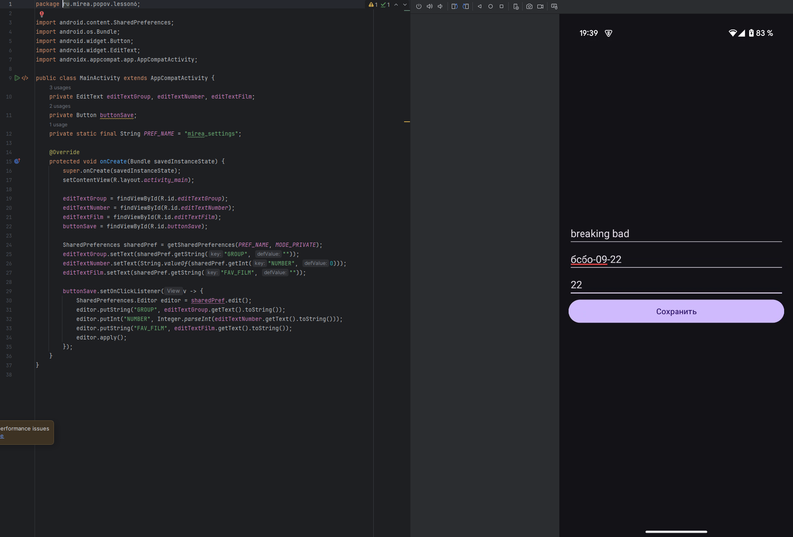

# Практика 6

## Модуль SharedPreferences

Создал модуль `SharedPreferencesApp`, в котором реализован экран с тремя полями и кнопкой. При вводе данных они сохраняются в файл `mirea_settings.xml` через `SharedPreferences`. При перезапуске приложения значения подгружаются автоматически. 

Файл настроек найден через `Device Explorer` по пути `/data/data/ru.mirea.popov.sharedpreferencesapp/shared_prefs/`. Скриншот добавлен в `res/raw`. Для доступа использован режим `MODE_PRIVATE`. Ключи: `GROUP`, `NUMBER`, `FAV_FILM`.

## Модуль SecureSharedPreferences

Создал модуль `SecureSharedPreferences`. Подключил зависимость `security-crypto` и реализовал шифрование настроек через `EncryptedSharedPreferences`. Используется `MasterKeys.AES256_GCM_SPEC`, ключ хранится в AndroidKeyStore. На экране вводится имя поэта, сохраняется в файл `secret_shared_prefs.xml`. Значения зашифрованы с использованием схем AES256-SIV и AES256-GCM. Файл найден через Device Explorer, скриншот сохранён в `res/raw`.

## Модуль InternalFileStorage

Создан модуль `InternalFileStorage`. В нём реализован ввод даты и описания события, которые сохраняются во внутреннее хранилище через `openFileOutput`. Файл называется `history.txt` и находится в директории `/data/data/ru.mirea.popov.internalfilestorage/files/`. Запись осуществляется в режиме `MODE_PRIVATE`. Файл найден через Device Explorer, скопирован и добавлен в `res/raw`.

## Модуль Notebook

Создан модуль `Notebook`, реализующий приложение для записи и чтения цитат. Внешняя память используется через `Environment.getExternalStoragePublicDirectory(Environment.DIRECTORY_DOCUMENTS)`. Пользователь вводит название файла и текст цитаты, которые сохраняются в файл `<имя>.txt`. 

Реализованы методы записи (`FileOutputStream`) и чтения (`BufferedReader`). Файлы были найдены в `Documents`, скопированы в `res/raw` через Device Explorer. Указано разрешение `WRITE_EXTERNAL_STORAGE`.
Если ввести название файла и нажать на “Загрузить данные из файла”, то строка цитаты заполнится текстом из файла.

## Модуль EmployeeDB

Создан модуль `EmployeeDB` с реализацией локальной БД на основе библиотеки Room. Созданы компоненты: `Entity` (`Employee`), `DAO` (`EmployeeDao`), `RoomDatabase` (`AppDatabase`), `Application` (`App`). В `MainActivity` осуществляется добавление супергероя в базу, получение всех записей и обновление по id. Используется `allowMainThreadQueries` для простоты выполнения. Логирование всех операций осуществляется через `Log.d`.

### MainActivity

### App

Класс приложения, наследуется от `Application`. Отвечает за инициализацию базы данных с помощью `Room.databaseBuilder` и реализует синглтон, чтобы база была доступна по всему приложению.

### AppDatabase

Абстрактный класс, расширяющий `RoomDatabase`, объединяет DAO-интерфейсы и настраивает БД. Содержит метод `employeeDao()` для доступа к DAO.

### Employee.

Класс-модель, помечен аннотацией `@Entity`, используется для генерации таблицы `employee` в базе данных. Содержит поля `id` (первичный ключ с автоинкрементом), `name` и `salary`.

## EmployeeDao

Интерфейс DAO (Data Access Object), описывает методы для работы с базой данных: добавление (`insert`), получение всех записей (`getAll`), выбор по ID (`getById`), обновление (`update`) и удаление (`delete`).

## MireaProject

В проект `MireaProject` добавлены два новых фрагмента. В профиле реализован ввод и сохранение данных пользователя (имя, возраст, email) с помощью `SharedPreferences`. Данные автоматически подгружаются при повторном открытии фрагмента. В работе с файлами реализован функционал ввода и сохранения текстовой заметки во внутреннее хранилище (`openFileOutput`). Созданный файл `user_note.txt` найден через `Device Explorer` и скопирован в `res/raw`.

---

На этом выполнение практики 6 закочено.