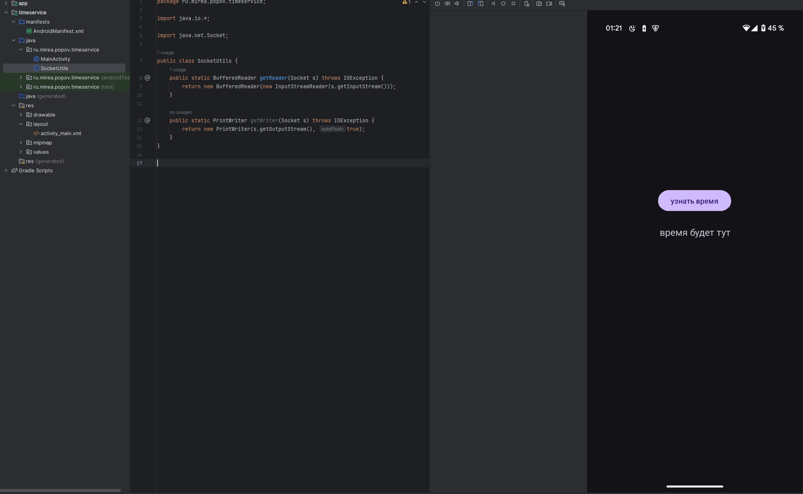

# Практика 7

## Модуль TimeService

Создан модуль `TimeService`, в котором реализовано подключение к серверу времени `time.nist.gov` по порту `13` с использованием `Socket`. Сетевая операция выполняется в фоновом потоке с помощью `AsyncTask`. 

После получения строки с текущим временем она отображается на экране. Добавлено разрешение на доступ в интернет в `AndroidManifest.xml`. Также был реализован вспомогательный класс `SocketUtils` для чтения входного потока. Интерфейс приложения включает кнопку и текстовое поле.

## Модуль HttpURLConnection

Создан модуль `HttpURLConnection`, в котором реализован запрос на получение информации об IP через сервис `https://ipinfo.io/json`. Использован класс `HttpURLConnection` для выполнения GET-запроса. В ответе парсятся поля `ip`, `city`, `region`, `country`, которые отображаются на экране. Запрос выполняется в фоновом потоке через `AsyncTask`, предварительно проверяется наличие интернет-соединения. В `AndroidManifest.xml` добавлены разрешения на интернет и доступ к состоянию сети. 

## Модуль FirebaseAuth

Создан модуль `FirebaseAuth`, в котором реализована регистрация, вход, верификация email и выход пользователя с использованием Firebase Authentication. Для аутентификации используется связка email и пароль. Интерфейс динамически меняется в зависимости от состояния авторизации. После подключения Firebase в Android Studio был автоматически создан файл `google-services.json`, содержащий конфигурацию проекта.

Для корректной сборки проекта были добавлены зависимости на библиотеку `firebase-auth`, а также настроен core library desugaring. В файле `build.gradle.kts` включена опция `isCoreLibraryDesugaringEnabled = true`, а также обновлена версия библиотеки `desugar_jdk_libs` до `2.1.3` — это необходимо для совместимости с библиотеками `play-services-tasks` и `play-services-basement`. После этого проект успешно собрался, а функциональность авторизации отрабатывает корректно.

## MireaProject

В проект `MireaProject` добавлен экран `LoginActivity`, реализованный на Java, с авторизацией пользователя через Firebase Authentication. Интерфейс включает поля email и пароля, а также кнопки создания аккаунта и входа. При успешной авторизации выполняется переход в `MainActivity`, а уже авторизованный пользователь автоматически перенаправляется на главный экран. Для корректной работы проекта подключены зависимости `firebase-auth`, `desugar_jdk_libs`, и добавлен файл `google-services.json`.

Также добавлен фрагмент `NetworkFragment`, реализующий сетевой запрос через библиотеку `Retrofit`. При загрузке фрагмента выполняется HTTP-запрос на сервис `https://ipinfo.io/json`, полученные данные десериализуются с помощью `Gson` и отображаются в пользовательском интерфейсе. Выводятся IP-адрес, город, регион и страна. Фрагмент подключён к `Navigation Drawer` путём добавления нового пункта меню `nav_network` и обработки его в `MainActivity`.

---

На этом выполнение практики 7 закончено.