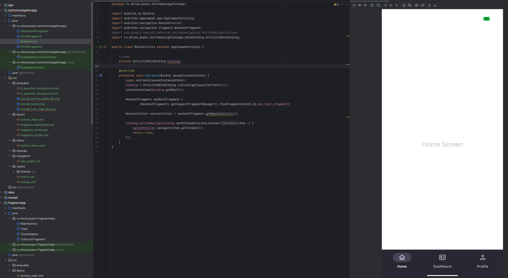

# Практика 7 (2 сем)

# BottomNavigationApp

В ходе выполнения задания был создан модуль `BottomNavigationApp`, в котором реализована навигация с использованием компонента Bottom Navigation. В проект была добавлена поддержка `ViewBinding` и `Navigation Component`, что позволило безопасно работать с интерфейсом и организовать централизованное управление переходами между экранами. 



Были разработаны три фрагмента: Home, Dashboard и Profile, каждый из которых подключён к навигационному графу `nav_graph.xml`. 

### nav_graph.xml:


Для отображения пунктов меню была создана нижняя панель `BottomNavigationView` с тремя элементами и установленными иконками. Главная активность содержит `NavHostFragment`, выполняющий замену фрагментов через `NavController`. 

### DashboardFragment.java: (в остальных фрагментах тот по сути такой же)


### activity_main.xml:


### bottom_menu.xml:


Цветовая схема приложения была обновлена через файл `colors.xml`. В результате получено корректно работающее приложение с нижней навигацией и структурированной архитектурой.

---

## NavigationDrawerApp

В ходе выполнения работы был создан модуль NavigationDrawerApp, в котором реализована навигация с использованием компонента Navigation Drawer. В проект была подключена библиотека Navigation Component и включён механизм `ViewBinding`. 

### MainActivity.java


Главная активность была адаптирована под работу боковой шторки: в разметку добавлен `DrawerLayout`, `NavigationView` и `Toolbar`, а также установлен `NavHostFragment` для управления отображением фрагментов. Были разработаны три экрана приложения — Home, Dashboard и Profile, которые подключены к навигационному графу `nav_graph.xml`.  Фрагменты полностью взяты из предыдущего задания

### drawer_menu.xml


`NavigationView` связан с `NavController` для корректного переключения пунктов меню. Реализован `AppBarConfiguration`, обеспечивающий работу кнопки-гамбургера и корректное отображение навигации. 

### nav_graph.xml


### activity_main.xml


Дополнительно была настроена обработка системной кнопки Back: при открытой шторке она закрывается, а при закрытой выполняется стандартное действие. Цветовая схема интерфейса обновлена через файл `colors.xml`. Итогом работы стало полнофункциональное приложение с боковым меню и структурированной архитектурой навигации.

# Контрольное задание

### **MainActivity.java**

В активность был добавлен переход на работу с Navigation Component. Удалена старая ручная навигация через `FragmentManager`, так как Navigation Component берет управление стеком и переходами на себя. В методе `onCreate()` получен `NavController` из `NavHostFragment`, и выполнена привязка нижнего меню навигации (`BottomNavigationView`) к этому контроллеру с помощью `NavigationUI.setupWithNavController()`. Благодаря этому нижнее меню синхронизировано с графом навигации, и переходы между экранами происходят автоматически, включая ведение back stack.


---

### **activity_main.xml**

Разметка корневого экрана была изменена под требования Navigation Component. Вместо `FrameLayout` был добавлен `FragmentContainerView`, объявленный как `NavHostFragment`. В него подключён граф навигации через атрибут `app:navGraph="@navigation/nav_graph"`. Внизу оставлена панель `BottomNavigationView`, которая отвечает за переключение между экранами приложения. Разметка теперь соответствует архитектуре одноконтейнерной навигации.


---

### **nav_graph.xml**

Создан граф навигации, в который добавлены три фрагмента:

— экран погоды (`WeatherFragment`)

— экран истории (`HistoryFragment`)

— экран профиля (`ProfileFragment`)

Указана стартовая точка (`WeatherFragment`). Каждый фрагмент описан как самостоятельная навигационная вершина, что позволяет выполнять переходы по их идентификаторам. Navigation Component автоматически обрабатывает стек навигации и восстановление состояния экранов.


---

### **bottom_nav_menu.xml**

Создан файл меню для нижней навигации. Добавлены три элемента, соответствующие трём экранам приложения: «Погода», «История» и «Профиль». Эти элементы связаны с навигационными узлами графа и используются для переключения между фрагментами. Navigation Component самостоятельно выделяет активный пункт меню при навигации.

```xml
<?xml version="1.0" encoding="utf-8"?>
<menu xmlns:android="http://schemas.android.com/apk/res/android">

    <item
        android:id="@+id/weatherFragment"
        android:title="Погода"
        android:icon="@drawable/icons8_happy_cloud_96" />

    <item
        android:id="@+id/historyFragment"
        android:title="История"
        android:icon="@drawable/icons8_time_machine_96" />

    <item
        android:id="@+id/profileFragment"
        android:title="Профиль"
        android:icon="@drawable/icons8_user_male_96" />

</menu>

```

---

## **WeatherFragment.java**

Фрагмент был адаптирован под работу с Navigation Component. Весь ручной код навигации через `FragmentManager` был удалён. Метод `openHistory()` переписан на использование объекта `NavController`, полученного через `NavHostFragment.findNavController()`. Теперь переход на экран истории выполняется вызовом `navController.navigate(R.id.historyFragment)`. Остальная логика работы фрагмента (наблюдение за LiveData, загрузка данных, отображение погоды и иконки) осталась неизменной.

```java
package ru.mirea.popov.weatherproject.presentation;

import android.os.Bundle;
import android.util.Log;
import android.view.LayoutInflater;
import android.view.View;
import android.view.ViewGroup;
import android.widget.Button;
import android.widget.ImageView;
import android.widget.ProgressBar;
import android.widget.TextView;

import androidx.fragment.app.Fragment;
import androidx.lifecycle.ViewModelProvider;
import androidx.navigation.NavController;
import androidx.navigation.fragment.NavHostFragment;

import com.squareup.picasso.Picasso;

import java.time.LocalTime;

import ru.mirea.popov.domain.models.WeatherInfo;
import ru.mirea.popov.weatherproject.R;

public class WeatherFragment extends Fragment {
    private WeatherViewModel vm;
    private TextView textCity, textTemp, textDesc, textUpdated;
    private ProgressBar progressBar;
    private Button buttonRefresh, buttonHistory;
    private ImageView imageWeatherIcon;

    @Override
    public View onCreateView(LayoutInflater inflater, ViewGroup container, Bundle savedInstanceState) {
        View view = inflater.inflate(R.layout.fragment_weather, container, false);

        imageWeatherIcon = view.findViewById(R.id.imageWeatherIcon);
        textCity = view.findViewById(R.id.textCity);
        textTemp = view.findViewById(R.id.textTemp);
        textDesc = view.findViewById(R.id.textDesc);
        textUpdated = view.findViewById(R.id.textUpdated);
        progressBar = view.findViewById(R.id.progressBar);
        buttonRefresh = view.findViewById(R.id.buttonRefresh);
        buttonHistory = view.findViewById(R.id.buttonHistory);

        vm = new ViewModelProvider(requireActivity(), new WeatherViewModelFactory(requireContext()))
                .get(WeatherViewModel.class);

        vm.getWeather().observe(getViewLifecycleOwner(), this::updateUI);

        vm.getLoading().observe(getViewLifecycleOwner(), isLoading -> {
            progressBar.setVisibility(isLoading ? View.VISIBLE : View.GONE);
            buttonRefresh.setEnabled(!isLoading);
        });

        buttonRefresh.setOnClickListener(v -> {
            Log.d("WeatherAPI", "нажата кнопка обновить");
            vm.loadWeatherFromApi("Москва");
        });

        buttonHistory.setOnClickListener(v -> openHistory());

        return view;
    }

    private void updateUI(WeatherInfo info) {
        if (info == null) return;
        textCity.setText(info.getCity());
        textTemp.setText(String.format("%.1f°C", info.getTemperature()));
        textDesc.setText(info.getDescription());
        if (info.getIconCode() != null && !info.getIconCode().isEmpty()) {
            String url = "https://openweathermap.org/img/wn/" + info.getIconCode() + "@2x.png";
            Picasso.get().load(url).into(imageWeatherIcon);
        }
        textUpdated.setText("последнее обновление: " + LocalTime.now().withNano(0));
    }

    private void openHistory() {
        NavController navController = NavHostFragment.findNavController(this);
        navController.navigate(R.id.historyFragment);
    }
}

```

---

На этом выполнение практической работы 7 закончено.