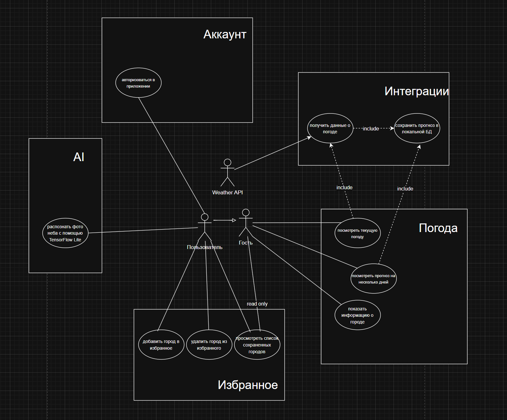

# Практика 9

## Диаграммы

В качестве проекта было выбрано обычное приложения погоды. С помощью TensorFlow Lite можно будет определить, является ли небо пасмурным или нет.

## Модуль

В ходе выполнения задания был создан новый проект с именем пакета **ru.mirea.popov.Lesson9**. Для реализации каркаса приложения использовался подход **Clean Architecture**, в котором код был разделён на три основных слоя: **domain**, **data** и **presentation**.

В слое **domain** были определены основные сущности и бизнес-логика. Создан класс `Movie`, описывающий объект фильма, интерфейс `MovieRepository` для работы с репозиторием, а также два use-case — `SaveMovieToFavoriteUseCase` для сохранения фильма и `GetFavoriteFilmUseCase` для получения сохранённого значения.

В слое **data** реализован конкретный репозиторий `MovieRepositoryImpl`, который хранит данные в оперативной памяти. Данный класс отвечает за фактическое сохранение и возврат объекта `Movie` и скрывает детали реализации от других слоёв.

Слой **presentation** представлен `MainActivity`, в котором размещены элементы пользовательского интерфейса: поле для ввода названия фильма, кнопки для сохранения и получения, а также текстовое поле для отображения результата. Activity взаимодействует с use-case, которые вызывают методы репозитория. Таким образом UI не зависит напрямую от слоя хранения данных.

---

На это выполнение практики 9 закончено.